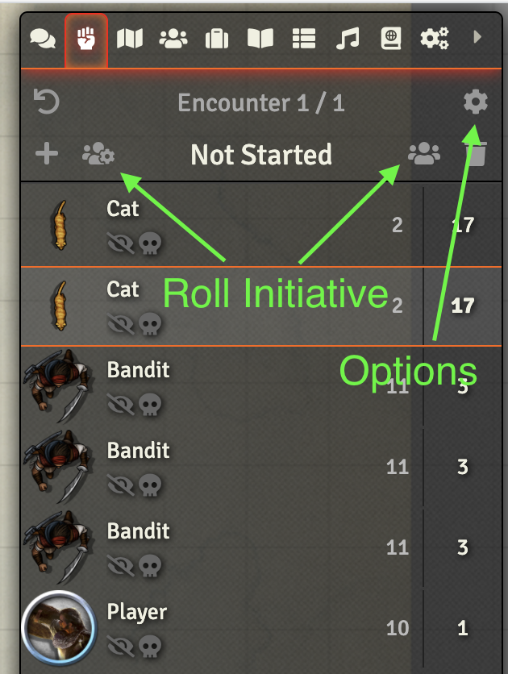

# Combat Simulator for 5e

Roll Group Initiative from the Combat Tracker in [Foundry VTT](https://foundryvtt.com/)

## Install

1. Go to the "Add-on Modules" tab in Foundry Setup
2. Click "Install Module" and paste this link: `https://raw.githubusercontent.com/<user>/<project>/master/module.json`
3. Open your world and go to the "Combat Tracker" tab
4. Populate the Combat Tracker with your desired Encounter by dragging tokens from a Scene to it
5. Check the Token Disposition field is correctly set to either Friendly (Party/PCs) or Hostile (NPCs/Monsters)
6. Click the lightning bolt icon to open the Combat Simulator window, and then Fight! to simulate the encounter

